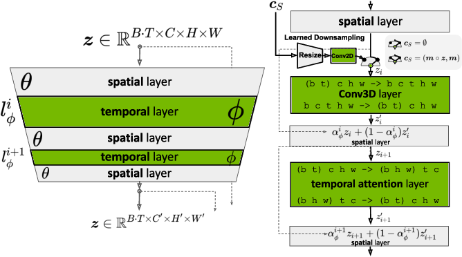

# Video LDM



## Overview

This is an unofficial PyTorch implementation of the following paper.

> **Align your Latents: High-Resolution Video Synthesis with Latent Diffusion Models**<br>
> Andreas Blattmann, Robin Rombach, Huan Ling, Tim Dockhorn, Seung Wook Kim, Sanja Fidler, Karsten Kreis <br>
> https://arxiv.org/abs/2304.08818

## Usage

```python
from videoldm import VideoLDM

model = VideoLDM.from_pretrained(
    'CompVis/stable-diffusion-v1-4',
    subfolder='unet',
    low_cpu_mem_usage=False
)
```

## Comments
- This code builds on [diffusers](https://huggingface.co/docs/diffusers/index). Thanks for open-sourcing!